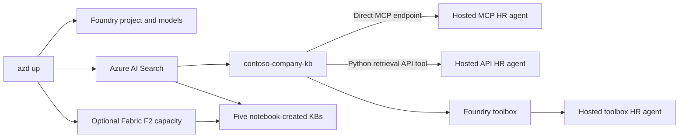

# Foundry IQ deep dive

This repository combines a five-part Microsoft Foundry IQ notebook lab with three deployable
[Microsoft Agent Framework](https://learn.microsoft.com/agent-framework/) HR agents. One `azd`
project provisions the shared Foundry project, `gpt-5.4` and `text-embedding-3-large` deployments,
Azure AI Search, storage, monitoring, and an optional F2 Fabric capacity. It then prepares Search
data, creates the agent's HR knowledge base, and deploys the agent directly from Python source.

## Architecture



The examples intentionally remain independent. The notebooks create learning-path knowledge bases.
All three hosted agents use their own `contoso-company-kb`: one connects through its direct Foundry IQ
MCP endpoint, one calls the `2026-05-01-preview` retrieval API from a custom Python tool, and one uses
a Foundry toolbox containing the knowledge base, web search, and code interpreter tools. None depends
on a knowledge base created by a notebook.

## Prerequisites

- An Azure subscription with permission to create resources and role assignments
- [Azure Developer CLI](https://learn.microsoft.com/azure/developer/azure-developer-cli/install-azd)
  with the `azure.ai.agents` extension available
- [uv](https://docs.astral.sh/uv/getting-started/installation/) and Python 3.12+
- Quota in one region for Foundry hosted agents, `gpt-5.4`, and `text-embedding-3-large`
- For notebook parts 3 and 5, a Fabric-capable tenant and a Fabric/Power BI license (or active Fabric
  trial) assigned to the account used by `az login`; the default deployment creates an F2 capacity
- For part 2, a `WEB_IQ_KEY` supplied by the Build lab organizer
- For parts 4 and 5, access to Microsoft 365 Work IQ data

## Provision and deploy

```bash
azd auth login
azd up
```

`azd up` provisions the resources, writes the generated local settings to `.env`, restores the
sample HR and health indexes, creates the independent HR agent knowledge base and Foundry toolbox,
prepares Fabric when enabled, and deploys all three agents. Toolbox creation reuses the provisioned
`kb-mcp-connection` remote-tool project connection. No Azure resources are included in this repository.

Set `DEPLOY_FABRIC_CAPACITY=false` before `azd up` to use an existing Fabric workspace or skip the
Fabric portions. Set `FABRIC_WORKSPACE_ID` and `FABRIC_ONTOLOGY_ID` in `.env` before running parts 3
and 5 when you manage Fabric separately.

## Run the notebooks

Install the notebook kernel into the root environment:

```bash
uv sync --locked --all-groups
uv pip install --python .venv/bin/python -r notebooks/requirements.txt
```

Add the externally supplied `WEB_IQ_KEY` to `.env` for part 2. Then open `notebooks/` in VS Code,
select `.venv/bin/python`, and run these in order:

1. `part1-standard-foundry-iq-kb.ipynb`
2. `part2-search-mcp-kb.ipynb`
3. `part3-fabric-iq-to-kb.ipynb`
4. `part4-work-iq-to-kb.ipynb`
5. `part5-work-iq-fabric-iq-to-kb.ipynb`

## Run and invoke the HR agents

Start either hosted-agent source locally:

```bash
azd ai agent run agent-foundry-iq-mcp
azd ai agent invoke --local "What benefits are available, and when do I need to enroll?"

azd ai agent run agent-foundry-iq-api
azd ai agent invoke --local "What benefits are available, and when do I need to enroll?"

azd ai agent run agent-foundry-iq-toolbox
azd ai agent invoke --local "What benefits are available, and when do I need to enroll?"
```

Redeploy an individual agent after code changes and invoke the deployed version:

```bash
azd deploy agent-foundry-iq-mcp
azd ai agent invoke agent-foundry-iq-mcp "What benefits are available, and when do I need to enroll?"

azd deploy agent-foundry-iq-api
azd ai agent invoke agent-foundry-iq-api "What benefits are available, and when do I need to enroll?"

azd deploy agent-foundry-iq-toolbox
azd ai agent invoke agent-foundry-iq-toolbox "What benefits are available, and when do I need to enroll?"
```

Direct source deployment is used because the final agent requires no custom OS packages. Foundry's
remote build resolves each agent folder's `pyproject.toml` and `uv.lock`, avoiding an unnecessary
container registry and image-build path.

## Validate locally

```bash
uv sync --locked --all-groups
uv run ruff check .
uv run python -m compileall -q infra src/agent-foundry-iq-mcp src/agent-foundry-iq-api src/agent-foundry-iq-toolbox
uv run python scripts/check_repo.py
az bicep build --file infra/main.bicep --stdout > /dev/null
azd show
```

See [ATTRIBUTION.md](ATTRIBUTION.md) for the exact upstream revisions and retained licenses.
